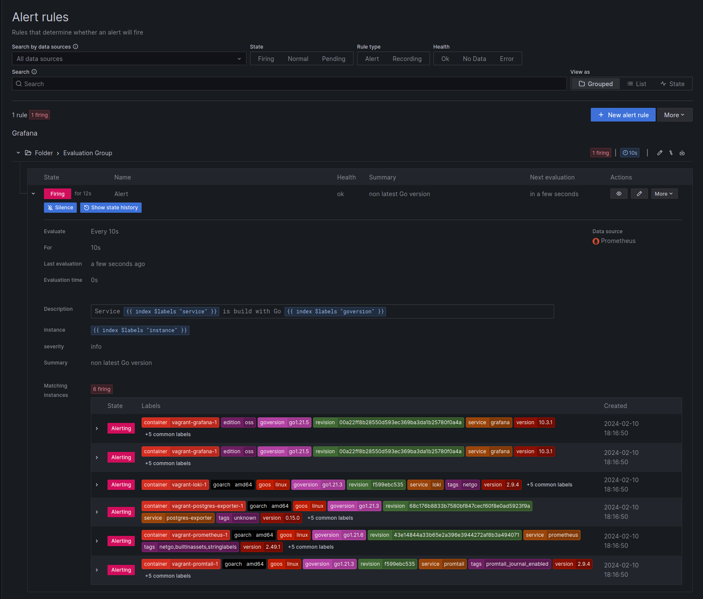

# Alerting

## Introduction

Metrics from the alerting engine, excerpt:

| Metric Name | Type | Description |
| ------------| ---- | ----------- |
| grafana_alerting_alerts | gauge | How many alerts by state |
| grafana_alerting_request_duration | histogram | Histogram of requests to the Alerting API |
| grafana_alerting_active_configurations | gauge | The number of active, non default Alertmanager  |configurations for grafana managed alerts
| grafana_alerting_rule_evaluations_total | counter | The total number of rule evaluations |
| grafana_alerting_rule_evaluation_failures_total | counter | The total number of rule evaluation  |failures
| grafana_alerting_rule_group_rules | gauge | The number of rules |
| grafana_alerting_rule_evaluation_duration_seconds_bucket | histogram | The time to evaluate a rule. |

## Contact

### Default message template

[Using Go’s templating language](https://grafana.com/docs/grafana/latest/alerting/manage-notifications/template-notifications/using-go-templating-language/)

Template data reference [doc](https://grafana.com/docs/grafana/latest/alerting/manage-notifications/template-notifications/reference/) | [source](https://github.com/grafana/alerting/blob/main/templates/template_data.go#L23-L58)
```go
type Template = template.Template
type KV = template.KV
type Data = template.Data

var FromGlobs = template.FromGlobs

type ExtendedAlert struct {
	Status        string             `json:"status"`
	Labels        KV                 `json:"labels"`
	Annotations   KV                 `json:"annotations"`
	StartsAt      time.Time          `json:"startsAt"`
	EndsAt        time.Time          `json:"endsAt"`
	GeneratorURL  string             `json:"generatorURL"`
	Fingerprint   string             `json:"fingerprint"`
	SilenceURL    string             `json:"silenceURL"`
	DashboardURL  string             `json:"dashboardURL"`
	PanelURL      string             `json:"panelURL"`
	Values        map[string]float64 `json:"values"`
	ValueString   string             `json:"valueString"` // TODO: Remove in Grafana 10
	ImageURL      string             `json:"imageURL,omitempty"`
	EmbeddedImage string             `json:"embeddedImage,omitempty"`
}

type ExtendedAlerts []ExtendedAlert

type ExtendedData struct {
	Receiver string         `json:"receiver"`
	Status   string         `json:"status"`
	Alerts   ExtendedAlerts `json:"alerts"`

	GroupLabels       KV `json:"groupLabels"`
	CommonLabels      KV `json:"commonLabels"`
	CommonAnnotations KV `json:"commonAnnotations"`

	ExternalURL string `json:"externalURL"`
}
```

https://github.com/grafana/alerting/blob/main/templates/default_template.go#L16-L69
```go
var DefaultTemplateString = `
{{ define "__subject" }}[{{ .Status | toUpper }}{{ if eq .Status "firing" }}:{{ .Alerts.Firing | len }}{{ if gt (.Alerts.Resolved | len) 0 }}, RESOLVED:{{ .Alerts.Resolved | len }}{{ end }}{{ end }}] {{ .GroupLabels.SortedPairs.Values | join " " }} {{ if gt (len .CommonLabels) (len .GroupLabels) }}({{ with .CommonLabels.Remove .GroupLabels.Names }}{{ .Values | join " " }}{{ end }}){{ end }}{{ end }}

{{ define "__text_values_list" }}{{ if len .Values }}{{ $first := true }}{{ range $refID, $value := .Values -}}
{{ if $first }}{{ $first = false }}{{ else }}, {{ end }}{{ $refID }}={{ $value }}{{ end -}}
{{ else }}[no value]{{ end }}{{ end }}

{{ define "__text_alert_list" }}{{ range . }}
Value: {{ template "__text_values_list" . }}
Labels:
{{ range .Labels.SortedPairs }} - {{ .Name }} = {{ .Value }}
{{ end }}Annotations:
{{ range .Annotations.SortedPairs }} - {{ .Name }} = {{ .Value }}
{{ end }}{{ if gt (len .GeneratorURL) 0 }}Source: {{ .GeneratorURL }}
{{ end }}{{ if gt (len .SilenceURL) 0 }}Silence: {{ .SilenceURL }}
{{ end }}{{ if gt (len .DashboardURL) 0 }}Dashboard: {{ .DashboardURL }}
{{ end }}{{ if gt (len .PanelURL) 0 }}Panel: {{ .PanelURL }}
{{ end }}{{ end }}{{ end }}

{{ define "default.title" }}{{ template "__subject" . }}{{ end }}

{{ define "default.message" }}{{ if gt (len .Alerts.Firing) 0 }}**Firing**
{{ template "__text_alert_list" .Alerts.Firing }}{{ if gt (len .Alerts.Resolved) 0 }}

{{ end }}{{ end }}{{ if gt (len .Alerts.Resolved) 0 }}**Resolved**
{{ template "__text_alert_list" .Alerts.Resolved }}{{ end }}{{ end }}


{{ define "__teams_text_alert_list" }}{{ range . }}
Value: {{ template "__text_values_list" . }}
Labels:
{{ range .Labels.SortedPairs }} - {{ .Name }} = {{ .Value }}
{{ end }}
Annotations:
{{ range .Annotations.SortedPairs }} - {{ .Name }} = {{ .Value }}
{{ end }}
{{ if gt (len .GeneratorURL) 0 }}Source: [{{ .GeneratorURL }}]({{ .GeneratorURL }})

{{ end }}{{ if gt (len .SilenceURL) 0 }}Silence: [{{ .SilenceURL }}]({{ .SilenceURL }})

{{ end }}{{ if gt (len .DashboardURL) 0 }}Dashboard: [{{ .DashboardURL }}]({{ .DashboardURL }})

{{ end }}{{ if gt (len .PanelURL) 0 }}Panel: [{{ .PanelURL }}]({{ .PanelURL }})

{{ end }}
{{ end }}{{ end }}


{{ define "teams.default.message" }}{{ if gt (len .Alerts.Firing) 0 }}**Firing**
{{ template "__teams_text_alert_list" .Alerts.Firing }}{{ if gt (len .Alerts.Resolved) 0 }}

{{ end }}{{ end }}{{ if gt (len .Alerts.Resolved) 0 }}**Resolved**
{{ template "__teams_text_alert_list" .Alerts.Resolved }}{{ end }}{{ end }}
`
```

Simple:
```go
{{ define "__subject" }}[{{ .Status | toUpper }}{{ if eq .Status "firing" }}:{{ .Alerts.Firing | len }}{{ if gt (.Alerts.Resolved | len) 0 }}, RESOLVED:{{ .Alerts.Resolved | len }}{{ end }}{{ end }}] {{ .GroupLabels.SortedPairs.Values | join " " }} {{ if gt (len .CommonLabels) (len .GroupLabels) }}({{ with .CommonLabels.Remove .GroupLabels.Names }}{{ .Values | join " " }}{{ end }}){{ end }}{{ end }}

{{ template "__subject" . }}

{{ range .Alerts.Firing }}
Labels:
{{ range .Labels.SortedPairs }} - {{ .Name }} = {{ .Value }}
{{ end }}Annotations:
{{ range .Annotations.SortedPairs }} - {{ .Name }} = {{ .Value }}
{{ end }}Values:
{{ if len .Values }}{{ $first := true }}{{ range $refID, $value := .Values -}}
{{ if $first }}{{ $first = false }}{{ else }}, {{ end }}{{ $refID }}={{ $value }}{{ end -}}
{{ else }}[no value]{{ end }}
{{ end }}
```

* https://community.grafana.com/t/custom-templated-alert-message-for-msteams-contains-default-templating/83761

Example: Go binaries

query: `{goversion!~"go1.22.*", goversion!=""}`
<br>
annotation:
* Summary: `non latest Go version`
* Description: `Service {{ index $labels "service" }} is build with Go {{ index $labels "goversion" }}`

custom annotation:
* `instance`: `{{ index $labels "instance" }}`
* `severity`: `info`

UI:


Request Body:
```json
{
  "receiver": "Generic",
  "status": "firing",
  "alerts": [
    {
      "status": "firing",
      "labels": {
        "alertname": "Alert",
        "branch": "HEAD",
        "container": "vagrant-promtail-1",
        "goarch": "amd64",
        "goos": "linux",
        "goversion": "go1.21.3",
        "grafana_folder": "Folder",
        "instance": "loki",
        "job": "containers",
        "revision": "f599ebc535",
        "service": "promtail",
        "tags": "promtail_journal_enabled",
        "version": "2.9.4"
      },
      "annotations": {
        "description": "Service promtail is build with Go go1.21.3",
        "instance": "loki",
        "severity": "info",
        "summary": "non latest Go version"
      },
      "startsAt": "2024-02-10T16:41:50Z",
      "endsAt": "0001-01-01T00:00:00Z",
      "generatorURL": "http://localhost:3000/alerting/grafana/e824fcfd-fcc8-49be-9f71-f357e33415f5/view?orgId=1",
      "fingerprint": "c9cc6043505f4d27",
      "silenceURL": "http://localhost:3000/alerting/silence/new?alertmanager=grafana\u0026matcher=alertname%3DAlert\u0026matcher=branch%3DHEAD\u0026matcher=container%3Dvagrant-promtail-1\u0026matcher=goarch%3Damd64\u0026matcher=goos%3Dlinux\u0026matcher=goversion%3Dgo1.21.3\u0026matcher=grafana_folder%3DFolder\u0026matcher=instance%3Dloki\u0026matcher=job%3Dcontainers\u0026matcher=revision%3Df599ebc535\u0026matcher=service%3Dpromtail\u0026matcher=tags%3Dpromtail_journal_enabled\u0026matcher=version%3D2.9.4\u0026orgId=1",
      "dashboardURL": "",
      "panelURL": "",
      "values": {
        "A": 1
      },
      "valueString": "[ var='A' labels={__name__=promtail_build_info, branch=HEAD, container=vagrant-promtail-1, goarch=amd64, goos=linux, goversion=go1.21.3, instance=loki, job=containers, revision=f599ebc535, service=promtail, tags=promtail_journal_enabled, version=2.9.4} value=1 ]"
    }
  ],
  "groupLabels": {
    "alertname": "Alert",
    "grafana_folder": "Folder"
  },
  "commonLabels": {
    "alertname": "Alert",
    "branch": "HEAD",
    "grafana_folder": "Folder",
    "instance": "loki",
    "job": "containers"
  },
  "commonAnnotations": {
    "instance": "loki",
    "severity": "info",
    "summary": "non latest Go version"
  },
  "externalURL": "http://localhost:3000/",
  "version": "1",
  "groupKey": "{}:{alertname=\"Alert\", grafana_folder=\"Folder\"}",
  "truncatedAlerts": 0,
  "orgId": 1,
  "title": "[FIRING:6] Alert Folder (HEAD loki containers)",
  "state": "alerting",
  "message": ""
}
```